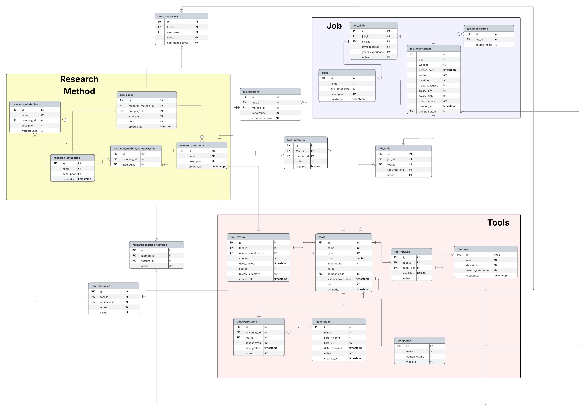

# Tool Kit Database

### Database Schema (DDL)
- The database schema (tables and relationships) is defined in  
[`Table.sql`](/SQL/tables.sql).

- Schema Viz: [Lucid ERD](https://lucid.app/lucidchart/c8f9a16b-6750-4a4a-a5bd-193fa2eaf2b2/edit?viewport_loc=-469%2C635%2C1109%2C559%2C94fcxOAn5dOq&invitationId=inv_f6e46a87-9759-4367-b821-42824750e3f7)
